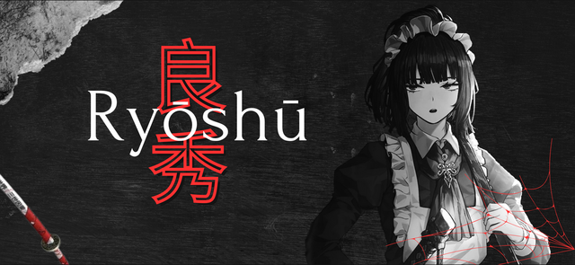
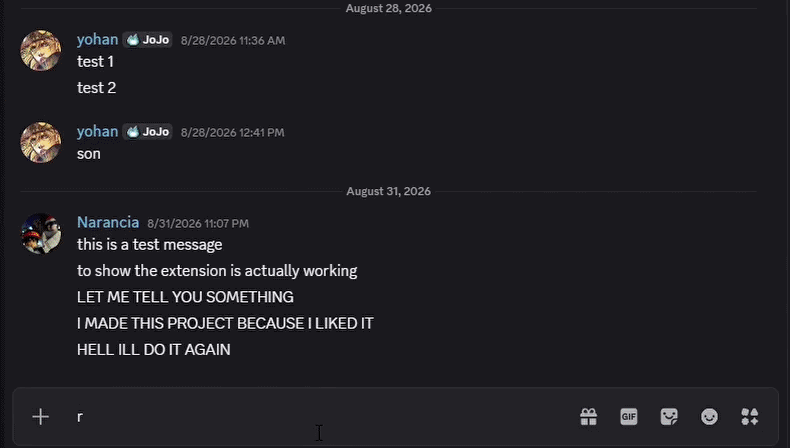
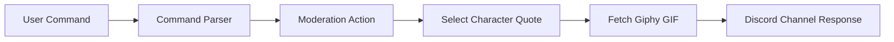

<div align="center">

# Ryoshu-Bot
**A Discord Moderation Bot capturing *Ryoshu's* sarcasm and to manage chaotic servers with sarcasm | Inspired by Limbus Company**

[](https://python.org)
[](https://discordpy.readthedocs.io)
[](https://giphy.com)

<br>



</div>
  
---

## Demo

<div align="center">



</div>

---

### Features

- **Mod Deployment**: Standard commands (`ban`, `kick`, `mute`) executed under the strict artistic sense of the Sinner.
- **Fascinated Artist**: Every moderation action triggers a randomized, character-accurate quote reflecting Ryoshu's sarcasm and sadism.
- **GIF Integration**: Automatically fetches and attaches relevant Tenor GIFs for battle-ready visual flair.

---

### Commands

| Command | Action | Voice Line Example |
| :--- | :--- | :--- |
| `!ban @user` | Erase | "T.N. (Target Neutralized)" |
| `!mute @user` | Silence | "Silence. An art piece speaks only when necessary." |
| `!gif [query]`| Art | "Displaying Art T.I.C." |

---

## Response Pipeline

Incoming commands pass through validation, character quote selection, and GIF attachment before responding to the channel.


---

## Getting Started

```bash
# Clone the repository
git clone https://github.com/JEmmanuelAbishai/ryoshu-bot.git

# Install dependencies
pip install -r requirements.txt
```

1. Create a `.env` file in the root directory.
2. Configure your tokens:
   ```env
   DISCORD_TOKEN=your_bot_token_here
   GIPHY_API_KEY=your_tenor_key_here
   ```
3. Launch the bot:
   ```bash
   python main.py
   ```
